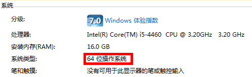
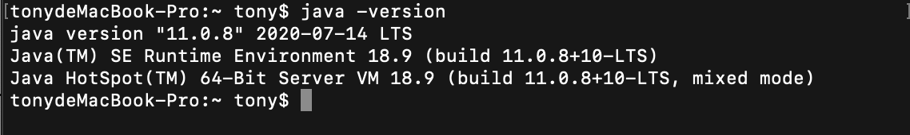
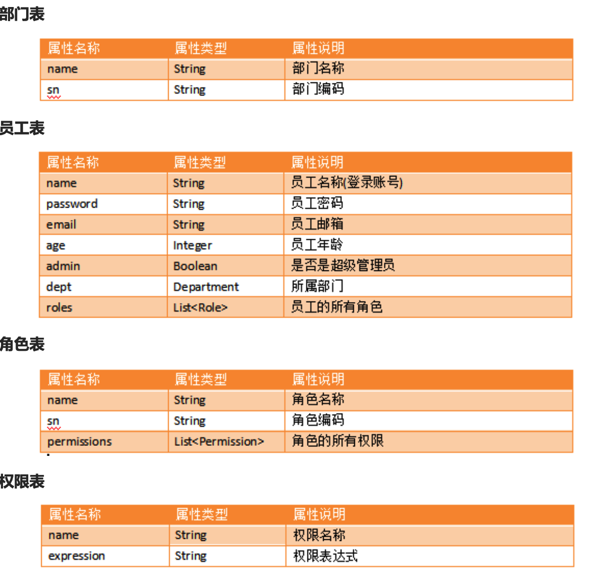

# 课程讲义


##  idea 开发工具的安装以及简单的使用

###  开发环境介绍

开发环境：支持软件或应用的开发、运行和维护的一组软件.

开发环境使用注意事项：
		1.在团队开发中,需避免环境差异带来的一些问题,避免出现自己电脑上没问题,别人电脑运行报错的情况. 
		2.开发环境需要跟部署项目的环境要一致,避免部署的时候出现问题.

目标： 清楚统一环境在开发中的重要性，所以尽量将环境和老师的环境统一,否则后期可能出现各种幽灵问题,极可能就是环境的问题.

**使用的开发环境：**

	开发工具（IDE）： ideaIU-2020 版本，简称 idea
	
	运行环境：JDK 1.11 环境


### 软件安装注意事项

1 安装的软件需和系统的位数保持一致。32bit 或 64bit

 计算机->鼠标右键 -> 点击属性



2 安装软件，不要存放到中文路径，或者带有空格的目录下，容易出现幽灵问题

3 软件安装最好统一盘符和目录（统一管理）

### 安装 JDK11

1 查看系统位数，32 位或者 64 位，目前一般是64位。

2 将 jdk 安装到一个统一个目录（openSource）并解压

3 拷贝 JDK 的 bin 路径，配置 JDK  的环境变量。

​	计算机 -> 右键属性 -> 高级系统设置 -> 环境变量-> path 就加入bin路径

4 查看是否配置成功，是否可用。



### 安装和使用 idea

idea 功能比较强大的一个开发工具，程序员比较青睐，原因是提示强大，插件多。但是不开源，收费。

官网 ： [www.jetbrains.com](http://www.baidu.com/link?url=BaeoIbpSDGVAl0v8cZnsAo1EwoXN2mkPOp9epLpJkqD3oZNx9jubutsrbTGKvp2u) 国外网站，访问比较慢，已经帮大家下载好了。

**安装：**

1  双击安装包，选择安装目录，一路next，到达以下设置页面,勾选之后一路next
​
​
​
​2 打开 idea ，输入激活码即可正常使用


**idea 创建项目**

1 创建一个新的项目


2 选择 JDK 安装的路径，点击New


3 创建一个简单的 Java 项目，不需要勾选框架，直接点击 Next

4 进去是否选择模板界面，不需要勾选，点击Next


5 输入要创建的 Java 项目名称和项目存储路径，点击 Finish 就完成了


6 创建包和类，测试项目是否成功


##  maven工具的搭建

### Maven 安装

#### 1、检查 JDK 的版本

因为 Maven 不同的版本对 JDK 是有要求的，具体请看[官网](https://maven.apache.org/docs/history.html)。
在命令行输入 java  -version，查询安装 JDK 是否正确并查询安装的版本。若没有配置好的话，按照一下步骤配置好：

- 添加 JAVA_HOME，需要指向 JDK 安装目录；
- 添加 PATH，添加 %JAVA_HOME%\bin。

#### 2、安装 Maven

把 apache-maven-x.x.x-bin.zip 解压到目录中（**目录路径最好不要有空格和中文**）。

#### 3、配置环境变量

- 配置环境变量，MAVEN_HOME，指向 maven 的根目录；
- 配置环境变量 Path，将 %MAVEN_HOME%\bin 追加到 Path 中。

##### 3.1、Win7 配置


##### 3.2、Win10 配置


#### 4、验证 Maven 安装

打开命令行窗口，输入入 mvn –v 执行，若执行类似如下效果即代表安装成功。


### Maven 设置

#### 1、本地仓库

运行过 Maven 命令才会在你的用户目录生成一个 .m2 目录，该目录下有个目录名 repository，这个就是所谓的本地仓库，主要存放是一些下载的 jar 文件。

本地仓库默认位置在用户目录/.m2/repository，本地仓库不建议在系统盘，最佳实践：

- 将 Maven 根目录的 conf/settings.xml 拷贝到 .m2 中，作为个人 Maven 配置文件；
- 在 settings.xml 文件中 <localRepository> 修改本地仓库的位置。

```xml
<?xml version="1.0" encoding="UTF-8"?>
<settings xmlns="http://maven.apache.org/SETTINGS/1.0.0"
          xmlns:xsi="http://www.w3.org/2001/XMLSchema-instance"
          xsi:schemaLocation="http://maven.apache.org/SETTINGS/1.0.0 http://maven.apache.org/xsd/settings-1.0.0.xsd">
    <!-- 本地仓库地址 -->
    <localRepository>你本地仓库的目录位置</localRepository>
</settings>
```

#### 2、配置中央仓库镜像

在有网情况下，官方中央仓库服务器在国外，所以很大可能出现下载失败的问题，所以我们配置一个中央仓库的镜像来降低下载失败的概率。

```xml
<?xml version="1.0" encoding="UTF-8"?>
<settings xmlns="http://maven.apache.org/SETTINGS/1.0.0"
          xmlns:xsi="http://www.w3.org/2001/XMLSchema-instance"
          xsi:schemaLocation="http://maven.apache.org/SETTINGS/1.0.0 http://maven.apache.org/xsd/settings-1.0.0.xsd">
    <!-- 本地仓库地址 -->
    <localRepository>你本地仓库的目录位置</localRepository>
    <mirrors>
        <!-- 阿里仓库镜像 -->
        <mirror>
            <id>alimaven</id>
            <name>aliyun maven</name>
            <url>http://maven.aliyun.com/nexus/content/groups/public/</url>
            <mirrorOf>central</mirrorOf>
        </mirror>
    </mirrors>
</settings>

```


### IDEA 中 Maven 的配置

配置安装的 Maven，设置 setttings.xml 和本地仓库。


##  数据库的调试

### 常见的关系数据库

| 数据库系统 | 所属公司              |
| ---------- | --------------------- |
| Oracle     | Oracle                |
| DB2        | IBM                   |
| SQL Server | MS                    |
| MySQL      | AB --> SUN --> Oracle |

Oracle : 运行稳定，可移植性高，功能齐全，性能超群！适用于大型企业领域，但是价格昂贵。
DB2   ：速度快、可靠性好，适于海量数据，恢复性极强。适用于大中型企业领域，但是价格昂贵。
SQL Server : 全面，效率高，界面友好，操作容易，但是不跨平台。适用于中小型企业领域。
MySQL : 开源，体积小，速度快。适用于中小型企业领域。

### MySQL 安装

**MySQL 安装过程中注意**

+ MySQL 的默认端口是:3306
+ **数据库默认字符集就是 utf8**
+ 设置密码 : admin

### DQL 查询操作（掌握）

#### 语法说明

**语法**

```mysql
SELECT 列1,列2,列3... FROM 表名 [WHERE];

-- SELECT  选择要查询的列
-- FROM    提供数据源 (表、视图或其他的数据源)
```

如果查询列表写  *  则结果列的显示顺序和创建表时的顺序一致。

```MYSQL
SELECT * FROM 表名 [WHERE]
```

可以自己调整顺序，在 select 后边加上要查询的列名。

**DQL 字句的执行顺序(重点掌握)**

1. FROM 子句 : 从哪张表中去查数据
2. WHERE 子句: 筛选需要的行数据
3. SELECT 子句: 筛选需要显示的列的数据
4. ORDER BY 子句: 排序操作

##  项目的演示

附件中可以演示项目

##  项目的准备（配置文件，页面）

附件中有空项目，需要学生导入到开发工具中

##  mvc思想的概述


JavaBean、JSP、Servlet，减少耦合，提高可维护性。

##  SpringMVC 框架的概述


- Servlet：Web 服务的模块，包含对 MVC 与 REST 的实现，Spring MVC。
- Web：提供与 Web 的集成，基于 Web 应用程序上下文。
- WebSocket：实现客户端与服务端主动通信。
- Portlet：提供了在 Portlet 环境中实现 MVC。

Spring MVC 是 Spring 对 MVC 思想实现，其有以下好处：

- 它解决 Web 开发中常见的问题（参数接收、文件上传、表单验证、国际化等），而且使用简单，与 Spring 无缝集成。 
- Spring3.0 后全面超越 Struts2，成为最优秀的 MVC 框架 （更安全，性能更好，更简单）。
- 支持 RESTful 风格的 URL 请求 ，非常容易与其他视图技术集成，如 Velocity、FreeMarker、JSP 等。
- 采用了松散耦合可插拔组件结构，比其他 MVC 框架更具扩展性和灵活性。

##  使用SpringMVC框架模拟部门列表功能

编写一个Controller，跳转到部门列表页面

##  SpringMVC框架的请求流程分析

### 1、图示流程


### 2、文字描述

- 用户发送出请求到前端控制器 DispatcherServlet。
- DispatcherServlet 收到请求调用 HandlerMapping（处理器映射器）。
- HandlerMapping 找到具体的处理器（通过 XML 或注解配置），生成处理器对象及处理器拦截器（若有），再一起返回给 DispatcherServlet。
- DispatcherServlet 调用 HandlerAdapter（处理器适配器）。
- HandlerAdapter 经过适配调用具体的处理器的某个方法（Handler/Controller）。
- Controller 执行完成返回 ModelAndView 对象。
- HandlerAdapter 将 Controller 返回的 ModelAndView 再返回给 DispatcherServlet。
- DispatcherServlet 将 ModelAndView 传给 ViewReslover（视图解析器）。
- ViewReslover 解析后返回具体 View（视图）。
- DispatcherServlet 根据 View 进行渲染视图（即将模型数据填充至视图中）。
- DispatcherServlet 响应用户。

###  前端控制器的理解

***什么是前端控制器***

在 MVC 框架中都存在一个前端控制器，在 WEB 应用的前端（Front）设置一个入口控制器（Controller），是用来提供一个集中的请求处理机制，所有的请求都被发往该控制器统一处理，然后把请求分发给各自相应的处理程序。一般用来做一个共同的处理，如权限检查，授权，日志记录等。因为前端控制的集中处理请求的能力，因此提高了可重用性和可拓展性。

**1.1、没有前端控制器**


**1.2、有前端控制器**


### Spring MVC 中的前端控制器

Spring MVC 已经提供了一个 DispatcherServlet 类作为前端控制器，所以要使用 Spring MVC 必须在 web.xml 中配置前端控制器。

把处理请求的对象称之为处理器或后端控制器，Spring MVC 中习惯称之为 Controller，如处理员工请求的就会命名为 EmployeeController。

##  处理控制器跳转

**RequestMapping 注解**

RequestMapping 注解是一个用来处理请求地址映射的注解，可用于类或方法上。用于类上，表示类中的所有响应请求的方法都是以该地址作为父路径。还可以限定请求类型和响应类型等。

**前端控制器映射路径**

- 配置如 *.do、*.htm 是最传统方式，可以访问静态文件（图片、 JS、 CSS 等），但不支持 RESTful 风格。
- 配置成 /，可以支持流行的 RESTful 风格，但会导致静态文件（图片、 JS、 CSS 等）被拦截后不能访问。
- 配置成 /*，是错误的方式，可以请求到 Controller 中，但跳转到调转到 JSP 时被拦截，不能渲染 JSP 视图，也会导致静资源访问不了。

可以在 webapp 目录下新建 static/demo.html，访问验证上面的说法。

**访问静态资源和 JSP 被拦截的原因**

Tomcat 容器处理静态资源是交由内置 DefaultServlet 来处理的（拦截路径是 /），处理 JSP 资源是交由内置的 JspServlet 处理的（拦截路径是*.jsp | *.jspx）。

启动项目时，先加载容器的 web.xml，而后加载项目中的 web.xml。当拦截路径在两者文件中配置的一样，后面会覆盖掉前者。

所以前端控制器配置拦截路径是 / 的所有静态资源都会交由前端控制器处理，而拦截路径配置 /*，所有静态资源和 JSP 都会交由前端控制器处理。


**怎么让静态资源可以访问到**

*方式一*

在 web.xml 中修改，修改前端控制器的映射路径如下：

```xml
<servlet-mapping>
	<servlet-name>dispatcherServlet</servlet-name>
	<url-pattern>*.do</url-pattern>
</servlet-mapping>
```

但注意，访问控制器里的处理方法时，请求路径须携带 .do。

*方式二*

在 mvc.xml，配置如下即可：

```xml
<mvc:default-servlet-handler/> 
```

上述配置会在 Spring MVC 上下文中创建存入一个 DefaultServletHttpRequestHandler 的 bean，它会对进入 DispatcherServlet 的请求进行筛查，若不是映射的请求，就将该请求交由容器默认的 Servlet 处理。


**消除视图前缀和后缀**

因为视图会固定放在一个位置，又因为统一选用一种视图技术，所以视图后缀名也是一样的，那么在处理方法设置视图路径的代码随着项目变大，存在着大量重复。而 Spring MVC 提供可通过配置的方法消除视图路径重复，只需要在 mvc.xml，配置如下即可：

```xml
<!-- 
	配置视图解析器
	配置这个，那么 Spring MVC 找视图的路径就是：前缀 + 逻辑视图名（处理方法设置或返回视图名） + 后缀名
-->
<bean class="org.springframework.web.servlet.view.InternalResourceViewResolver">
	<!-- 视图前缀 -->
	<property name="prefix" value="/WEB-INF/views/"/>
	<!-- 视图后缀 -->
	<property name="suffix" value=".jsp"/>
</bean>
```

##  三层架构的理解

为什么要有架构？

这是为了满足“低耦合，高内聚”，实现代码的健壮性和可扩展性。比如为了更好的降低各层间的耦合度，在三层架构程序设计中，采用面向抽象编程。即上层对下层的调用，是通过接口实现的。而下层对上层的真正服务提供者，是下层接口的实现类。服务标准（接口）是相同的，服务提供者（实现类）可以更换。

软件(web应用)开发的模式：Model1（模型一），Model2(模型二)，MVC


## 2.1 Model1 模型一

以  JSP 为中心

**核心技术**： JSP + JavaBean


**JSP的职责**:

1. 界面输出（页面渲染）.
2. 接受请求参数
3. 调用业务方法,处理请求
4. 控制界面跳转.

**优势**:  适用于简单的功能,快速开发.
**劣势**:  没有体现出责任分离原则.


## 2.2 Model2 模型二

解决了Model1 存在的责任不分离的问题，以 Servlet 为中心 (所有请求都发送给 Servlet)
**核心技术**： JSP + Servlet + JavaBean


**Servlet/JSP/JavaBean 的职责**:

+ JSP :  界面输出(页面渲染)
+ Servlet
  + 1:接受请求参数,封装成对象
  + 2:调用业务方法,处理请求
  + 3:控制跳转.
+ JavaBean : 体现封装，封装数据，封装业务操作API,可重复使用.


**优势**:  体现出责任分离原则，提高代码可读性和维护度
**劣势**:  实现相对 Model1 复杂一点.

三层架构是什么？

三层架构由用户界面层/表示层（User Interface），业务逻辑层（Business Logic Layer）和数据访问层（Data Acess Layer）构成。

其中每一层的作用为：

用户界面层：负责与用户进行交互。
业务逻辑层：主要是针对具体的问题的操作，也可以理解成对数据层的操作，对数据业务逻辑处理。
数据访问层：主要是对非原始数据（数据库或者文本文件等存放数据的形式）的操作层，也就是说是对数据库，而不是对数据的操作，具体为业务逻辑层或用户界面层提供数据服务。


## MyBatis框架的介绍

MyBatis 是一款优秀的**持久层框架**，它支持定制化 SQL、存储过程以及高级映射。**MyBatis 避免了几乎所有的 JDBC 代码和手动设置参数以及获取结果集**。MyBatis 可以使用简单的 XML 或注解来配置和映射原生类型、接口和 Java 的 POJO（Plain Old Java Objects，普通老式 Java 对象）为数据库中的记录。

**mybatis 框架架构图:**


我们把 Mybatis 的功能架构分为三层：

1. API 接口层：提供给外部使用的接口API，**开发人员通过这些本地API来操作数据库**。接口层一接收到调用请求就会调用数据处理层来完成具体的数据处理。

2. 数据处理层：负责具体的SQL查找、SQL解析、SQL执行和执行结果映射处理等。它主要的目的是根据调用的请求完成一次数据库操作。

3. 基础支撑层：负责最基础的功能支撑，包括连接管理、事务管理、配置加载和缓存处理，这些都是共用的东西，将他们抽取出来作为最基础的组件。为上层的数据处理层提供最基础的支撑。


我们首先要了解到几个单词的概念：

**mybatis配置**

SqlMapConfig.xml，此文件作为mybatis的全局配置文件，配置了mybatis的运行环境等信息。 mapper.xml文件即sql映射文件，文件中配置了操作数据库的sql语句。此文件需要在SqlMapConfig.xml中加载。

**SqlSessionFactoryBuilder（构建器）**

根据配置信息或Java代码来构建SqlSessionFactory对象。一旦创建了 SqlSessionFactory，就不再需要它了。因此 SqlSessionFactoryBuilder 实例的最佳作用域是方法作用域 作用：创建SqlSessionFactory对象。  

**SqlSessionFactory（会话工厂）**

通过mybatis环境等配置信息构造SqlSessionFactory即会话工厂

好比是DataSource，线程安全的，在应用运行期间不要重复创建多次，建议使用单例模式。 作用：创建SqlSession对象

**SqlSession（会话）**

好比是Connection，线程不安全的，每次使用开启新的SqlSession对象，使用完毕正常关闭。因此是不能被共享的，所以它的最佳的作用域是请求或方法作用域。绝对不能将 SqlSession 实例的引用放在一个类的静态域，甚至一个类的实例变量也不行。也绝不能将 SqlSession 实例的引用放在任何类型的管理作用域中，比如 Servlet 架构中的 HttpSession。应该把这个关闭操作放到 finally 块中以确保每次都能执行关闭。如：

```java
// 加载MyBatis的主配置文件
        InputStream inputStream = Resources.getResourceAsStream("mybatis-config.xml");
        // 通过构建器（SqlSessionFactoryBuilder）构建一个SqlSessionFactory工厂对象
        SqlSessionFactory factory = new SqlSessionFactoryBuilder().build(inputStream);
        // 从工厂对象中获取SqlSession会话
        SqlSession sqlSession = factory.openSession();

```


***我们要梳理一个流程***

要想发送SQL语句要先获取SqlSession对象，要获取SqlSession对象，要先获取SqlSessionFactory工厂对象，要获取SqlSessionFactory工厂对象，要使用SqlSessionFactoryBuilder构建器对象通过调用builder方法来加载MyBiatis的主配置文件来获取。

## MyBatis框架主配置文件的详解

每个基于 MyBatis 的应用都是以一个 SqlSessionFactory 的实例为中心的。

那么要想获取SqlSessionFactory的实例对象，可以通过它的构建器对象（SqlSessionFactoryBuilder）从XML文件中构建出来。

因此我们要先提供一个XML文件。那么这个XML文件存放到哪里呢？ 由于MyBatis 包含一个名叫 Resources 的工具类，它包含一些实用方法，可使从 classpath 路径下面加载资源文件更加容易。所以我们可以在src/main下面定义一个resources文件夹，用来存放资源文件。

XML 配置文件（configuration XML）中包含了对 MyBatis 系统的核心设置，包含获取数据库连接实例的数据源（DataSource）和决定事务作用域和控制方式的事务管理器（TransactionManager）。

```xml
<?xml version="1.0" encoding="UTF-8" ?>
<!DOCTYPE configuration
        PUBLIC "-//mybatis.org//DTD Config 3.0//EN"
        "http://mybatis.org/dtd/mybatis-3-config.dtd">
<configuration>
    <environments default="development">
        <environment id="development">
            <!--MyBatis 提供的事务管理器-->
            <transactionManager type="JDBC"/>
            <!--MyBatis 提供的连接池-->
            <dataSource type="POOLED">
                <!--连接数据库的四要素-->
                <property name="driver" value="com.mysql.jdbc.Driver"/>
                <property name="url" value="jdbc:mysql:///mybatis"/>
                <property name="username" value="root"/>
                <property name="password" value="root123"/>
            </dataSource>
        </environment>
    </environments>
</configuration>

```

## 

***环境配置（environments）***

MyBatis 可以配置成适应多种环境，这种机制有助于将 SQL 映射应用于多种数据库之中， 现实情况下有多种理由需要这么做。例如，开发、测试和生产环境需要有不同的配置；或者想在具有相同 Schema 的多个生产数据库中使用相同的 SQL 映射。还有许多类似的使用场景。

不过要记住：尽管可以配置多个环境，但每个 SqlSessionFactory 实例只能选择一种环境。

***事务管理器（transactionManager）***

在 MyBatis 中有两种类型的事务管理器（也就是 type="[JDBC|MANAGED]"）：

JDBC – 这个配置直接使用了 JDBC 的提交和回滚设施，它依赖从数据源获得的连接来管理事务作用域。

***数据源（dataSource）***

dataSource 元素使用标准的 JDBC 数据源接口来配置 JDBC 连接对象的资源。

POOLED– 这种数据源的实现利用“池”的概念将 JDBC 连接对象组织起来，避免了创建新的连接实例时所必需的初始化和认证时间。 这种处理方式很流行，能使并发 Web 应用快速响应请求


***属性（properties）***

这些属性可以在外部进行配置，并可以进行动态替换。你既可以在典型的 Java 属性文件中配置这些属性

***类型别名（typeAliases）***

类型别名可为 Java 类型设置一个缩写名字。 它仅用于 XML 配置，意在降低冗余的全限定类名书写。
也可以指定一个包名，MyBatis 会在包名下面搜索需要的 Java Bean，比如：

```
<typeAliases>
  <package name="domain.blog"/>
</typeAliases>

```

***映射器（mappers）***

既然 MyBatis 的行为已经由上述元素配置完了，我们现在就要来定义 SQL 映射语句了。 但首先，我们需要告诉 MyBatis 到哪里去找到这些语句。 在自动查找资源方面，Java 并没有提供一个很好的解决方案，所以最好的办法是直接告诉 MyBatis 到哪里去找映射文件。 你可以使用相对于类路径的资源引用，或完全限定资源定位符（包括 file:/// 形式的 URL），或类名和包名等。


## Mapper接口的定义

Mapper映射文件主要是用来封装SQL语句。由于它的异常强大，映射器的XML文件就显得相对简单。官网上有个数据：比如完成同一个功能使用MyBatis提供的XML方式比使用传统的JDBC方式要节省95%的代码量。足以可见mapper映射文件的好处。

关于Mapper的命名，和我们常用的DAO后缀类似，只是一种习惯而已， 使用 Mapper 作为后缀 。通常称XML为Mapper.xml 文件。

在 Mapper.xml 文件中，有几个元素，先了解一下，后面会细讲：

```none
resultMap – 是最复杂也是最强大的元素，用来描述如何从数据库结果集中来加载对象。
sql – 可被其他语句引用的可重用语句块。
insert – 映射插入语句
update – 映射更新语句
delete – 映射删除语句
select – 映射查询语句

```

我们先来看select元素。查询语句是 MyBatis 中最常用的元素之一，把数据只存入数据库不进行任何操作没有什么价值。应该能对数据进行增删改查操作才是有意义的。在我们实际开发中，查询操作比其他（增删改）操作要频繁很多。查询是最多的，也是最复杂的。先来创建一个Department相关的查询操作。如：

```xml
 <?xml version="1.0" encoding="UTF-8" ?>
<!DOCTYPE mapper
        PUBLIC "-//mybatis.org//DTD Mapper 3.0//EN"
        "http://mybatis.org/dtd/mybatis-3-mapper.dtd">
<mapper namespace="cn.wolfcode.mapper.DepartmentMapper">
     <!--
     select 表示查询语句的标签。标签体的内容即是查询的SQL语句
          id:SQL语句的唯一标识
          parameterType：传入这条SQL语句的参数的类的完全限定名或别名，
                 因为 MyBatis 可以通过 TypeHandler 推断出具体传入语句的参数，故可以省略
          resultType：返回期望的类型（类的完全限定名或别名），用来接收查询的结果。

      -->
    <select id="selectById" resultType="cn.wolfcode.domain.Department">
        SELECT id,name,sn FROM department
        WHERE id = #{id}
    </select>
    
     <!--查询所有部门信息-->
    <select id="selectAll" 
    resultType="cn.wolfcode.domain.Department">
        SELECT id,name,sn FROM department
       
    </select>

</mapper>

```

***使用注意***

在接口中定义 CRUD 等操作方法。Mapper 组件 =  Mapper 接口 +  Mapper XML 文件。

- 接口的命名为实体名 Mapper，一般和其对应 XML 文件放一起（只要编译之后字节码文件和 XML 文件在一起）；
- XML 命名空间用其对应接口的全限定名；
- Mapper 接口的方法名要和 Mapper XML 文件元素（select | update | delete | insert） id 值一样；
- 方法的返回类型对应 SQL 元素中定义的 resultType / resultMap 类型；
- 方法的参数类型对应 SQL 元素中定义的 paramterType 类型（一般不写）。


## Mapper映射文件的详解

 mybatis中,访问数据库的SQL语句是编写在mapper配置文件中的,程序员按照这个文件约定的格式进行配置即可

   在包 cn.wolfcode.mybatis.mapper 中创建配置文件: UserMapper.xml

####    拷贝下面的约束信息到配置文件中

   ``` 
   <?xml version="1.0" encoding="UTF-8" ?>
   <!DOCTYPE mapper
     PUBLIC "-//mybatis.org//DTD Mapper 3.0//EN"
     "http://mybatis.org/dtd/mybatis-3-mapper.dtd">

   ```

####    在配置文件中添加 SQL 语句

   ``` 
   <!--
   	一个项目可以操作多张表
   	每张表都需要一个mapper配置文件来编写SQL语句
   	每条SQL语句都需要有一个唯一的标识
   	这个唯一的标识由 namespace + sqlid 组成
   	使用下面的namespace+sqlid就得到了保存用户信息的唯一标识:
   	cn.wolfcode.mybatis.mapper.UserMapper.insert
   	接下来,我们就可以使用上面的标识找到这条SQL语句了
   -->
   <mapper namespace="cn.wolfcode.mybatis.mapper.UserMapper">
     <insert id="insert">
       insert into user(name,age,salary,hiredate) 
       values(#{name}, #{age}, #{salary}, #{hiredate})
     </insert>
   </mapper>

   ```

####   select

查询语句是 MyBatis 中最常用的元素之一——光能把数据存到数据库中价值并不大，还要能重新取出来才有用，多数应用也都是查询比修改要频繁。 MyBatis 的基本原则之一是：在每个插入、更新或删除操作之间，通常会执行多个查询操作。因此，MyBatis 在查询和结果映射做了相当多的改进。一个简单查询的 select 元素是非常简单的。比如：

```
<select id="selectPerson" parameterType="int" resultType="hashmap">
  SELECT * FROM PERSON WHERE ID = #{id}
</select>

```

这个语句名为 selectPerson，接受一个 int（或 Integer）类型的参数，并返回一个 HashMap 类型的对象，其中的键是列名，值便是结果行中的对应值。

#### 注意参数符号：

```
#{id}

```

这就告诉 MyBatis 创建一个预处理语句（PreparedStatement）参数，在 JDBC 中，这样的一个参数在 SQL 中会由一个“?”来标识，并被传递到一个新的预处理语句中，就像这样：

```
// 近似的 JDBC 代码，非 MyBatis 代码...
String selectPerson = "SELECT * FROM PERSON WHERE ID=?";
PreparedStatement ps = conn.prepareStatement(selectPerson);
ps.setInt(1,id);

```

#### id	在命名空间中唯一的标识符，可以被用来引用这条语句。

#### parameterType	将会传入这条语句的参数的类全限定名或别名。这个属性是可选的，因为 MyBatis 可以通过类型处理器（TypeHandler）推断出具体传入语句的参数，默认值为未设置（unset）。

#### resultType	期望从这条语句中返回结果的类全限定名或别名。 注意，如果返回的是集合，那应该设置为集合包含的类型，而不是集合本身的类型。 

#### 


#### **注意**: 一定记得在 mybatis-config.xml 配置文件中关联映射文件

```
    <mappers>
       <!--
   		这里是mapper文件的路径,所以使用/分割
   	-->
       <mapper resource="cn/wolfcode/mybatis/mapper/UserMapper.xml"/>
   </mappers>
   

```


## 整合SpringMVC，Spring，MyBatis框架，完善部门列表功能

```
@Controller
@RequestMapping("/department")
public class DepartmentController {

    @Autowired
    private IDepartmentService departmentService;

    @RequestMapping("/list")
    public String list(Model model, @ModelAttribute("qo") QueryObject qo) {

        List<Department> list = departmentService.selectByCondition(qo);

        model.addAttribute("result", list);

        return "department/list";
    }
}

```

```java
public interface IDepartmentService {

    List selectByCondition(QueryObject qo);
}


```

```java
@Service
public class DepartmentServiceImpl implements IDepartmentService {

    @Autowired
    private DepartmentMapper departmentMapper;

    @Override
    public List selectByCondition(QueryObject qo) {
        List<Department> departmentList = departmentMapper.selectAll();
        return  departmentList;
    }
}

```

```java
public interface DepartmentMapper {
    
    List<Department> selectAll();
}


```


```xml
<?xml version="1.0" encoding="UTF-8"?>
<!DOCTYPE mapper PUBLIC "-//mybatis.org//DTD Mapper 3.0//EN" "http://mybatis.org/dtd/mybatis-3-mapper.dtd">
<mapper namespace="cn.wolfcode.rbac.mapper.DepartmentMapper">
  <resultMap id="BaseResultMap" type="cn.wolfcode.rbac.domain.Department">
    <id column="id" jdbcType="BIGINT" property="id" />
    <result column="name" jdbcType="VARCHAR" property="name" />
    <result column="sn" jdbcType="VARCHAR" property="sn" />
  </resultMap>

  <select id="selectAll" resultMap="BaseResultMap">
    select id, name, sn
    from department
  </select>
</mapper>

```


## PageHelper插件的使用

我们知道，在MySQL中，分页的sql是使用limit来做，如果我们自己写sql，那分页肯定是没有任何问题的。 如：

```sql
limit关键字的用法是
LIMIT [offset,] rows
offset是相对于首行的偏移量(首行是0)，rows是返回条数。

# 每页10条记录，取第一页，返回的是前10条记录
select * from tableA limit 0,10;
# 每页10条记录，取第二页，返回的是第11条记录，到第20条记录，
select * from tableA limit 10,10;

```

但是一旦model多了起来，复杂了起来，我们很自然的想到使用mybatis的逆向工程来生成相应的po和mapper，但是同时也会带来弊端，比如这里的分页问题就不好解决了。 可能有人会说，我可以修改生成的文件，没错，这是可行的，但是对于使用Mybatis时，写分页，需要先写一个查询count的select语句，然后再写一个真正分页查询的语句，当查询条件多了之后，会发现真不想花双倍的时间写count和select， 

所以我们希望通过逆向工程生成的文件不去动它，达到分页的目的。使用PageHelper插件可以就可以完成分页。

PageHelper是MyBatis中非常方便的第三方分页插件

### PageHelper的介绍

PageHelper是国内非常优秀的一款开源的mybatis分页插件，它支持基本主流与常用的数据库，例如MySQL、oracle、mariaDB、DB2、SQLite、Hsqldb等。
注意：本次使用方式是基于oracle数据库中操作的。

### PageHelper入门使用步骤

#### 1.在pom.xml中添加依赖坐标

```xml
<dependency>
  <groupId>com.github.pagehelper</groupId>
  <artifactId>pagehelper</artifactId>
  <version>5.1.8</version>
</dependency>

```

#### 2.在MyBatis的配置文件中配置拦截器插件及其相关参数属性值

```xml
<!--配置PageHelper分页插件-->
<plugins>
    <plugin interceptor="com.github.pagehelper.PageInterceptor">
            <!-- 使用下面的方式配置参数，后面会有所有的参数介绍 -->
            <property name="helperDialect" value="mysql"/>
            <!--默认值为 false，当该参数设置为 true 时，如果 pageSize=0就会查询出全部的结果
            通过测试，这个属性不添加， pageSize=0也是查询全部的结果-->
            <property name="pageSizeZero" value="true"/>
            <!--
            分页合理化参数，默认值为false。当该参数设置为 true 时，pageNum<=0 时会查询第一页，
            pageNum>pages（超过总数时），会查询最后一页。默认false 时，直接根据参数进行查询。
            -->
            <property name="reasonable" value="true"/>
    </plugin>
</plugins>

```

#### 3.PageHelper.startPage 静态方法调用

使用方式：在需要进行分页的Mybatis查询方法前调用PageHelper.startPage静态方法,跟在方法后的第一个Mybatis查询方法会被进行分页。

 	PageHelper.startPage(offset, row);

```java
public class QueryObject {

    private int currentPage =1;  //当前页
    private int pageSize = 3; // 每页显示几条数据

    public int getCurrentPage() {
        return currentPage;
    }

    public void setCurrentPage(int currentPage) {
        this.currentPage = currentPage;
    }

    public int getPageSize() {
        return pageSize;
    }

    public void setPageSize(int pageSize) {
        this.pageSize = pageSize;
    }
}

```

## 部门数据的删除功能的实现

```java
@Controller
@RequestMapping("/department")
public class DepartmentController {

    @Autowired
    private IDepartmentService departmentService;
  
    @RequestMapping("/delete")
    @ResponseBody
    public JsonResult delete(Long id) {

       try {
                  departmentService.deleteById(id);
                  return  new JSONResult();
            } catch (Exception e) {
                  e.printStackTrace();
                  return  new JSONResult().mark("删除失败，请稍后重试");
            }
        return new JsonResult();
    }
}

```


```java
public class JSONResult {

    private boolean success = true ; // 请求结果的标记  true 表示响应成功， false 表示响应失败

    private String msg;  // 失败的原因


    public boolean isSuccess() {
        return success;
    }

    public String getMsg() {
        return msg;
    } 

    public JSONResult mark(String msg){
        this.msg = msg;
        this.success = false;
        return this;
    } 
}

```


```java
public interface IDepartmentService {

    void deleteById(Long id);
}

@Service
public class DepartmentServiceImpl implements IDepartmentService {

    @Autowired
    private DepartmentMapper departmentMapper;

    @Override
    public void deleteById(Long id) {
        departmentMapper.deleteByPrimaryKey(id) ;
    }
}

```

```java
public interface DepartmentMapper {
    
      void  deleteByPrimaryKey(Long id);
    }

```

```xml
<delete id="deleteByPrimaryKey" >
  delete from department where id = #{id}
</delete>

```


## 部门数据编辑功能的实现 & 部门数据新增功能的实现


```java
@Controller
@RequestMapping("/department")
public class DepartmentController {
  
@Autowired
private IDepartmentService departmentService;

@RequestMapping("/saveOrUpdate")
public String saveOrUpdate(Department department) {

    departmentService.saveOrUpdate(department);

    return "redirect:/department/list";
		}
  }

```


```java
public interface IDepartmentService {
void saveOrUpdate(Department department);
}

```


```java
public class DepartmentServiceImpl implements IDepartmentService {

    @Override
    public void saveOrUpdate(Department department) {

        if (department.getId()!=null){
            departmentMapper.updateByPrimaryKey(department);
        }else{
            departmentMapper.insert(department);
        }
    }
}    

```

```java
public interface DepartmentMapper {
int insert(Department record);

int updateByPrimaryKey(Department record);
}

```


```xml
<insert id="insert" keyColumn="id" keyProperty="id" parameterType="cn.wolfcode.rbac.domain.Department" useGeneratedKeys="true">
    insert into department (name, sn)
    values (#{name,jdbcType=VARCHAR}, #{sn,jdbcType=VARCHAR})
  </insert>
  <update id="updateByPrimaryKey" parameterType="cn.wolfcode.rbac.domain.Department">
    update department
    set name = #{name,jdbcType=VARCHAR},
      sn = #{sn,jdbcType=VARCHAR}
    where id = #{id,jdbcType=BIGINT}
  </update>

```


## 角色列表功能的实现

```java
@Controller
@RequestMapping("/role")
public class RoleController {

    @Autowired
    private IRoleService roleService;

    @RequestMapping("/list")
    public String list(Model model, @ModelAttribute("qo") QueryObject qo) {

        PageInfo pageInfo = roleService.selectByCondition(qo);

        model.addAttribute("result", pageInfo);

        return "role/list";
    }
}

```

```java
public interface IRoleService {

    PageInfo selectByCondition(QueryObject qo);
    }

```

```java
@Service
public class RoleServiceImpl implements IRoleService {

    @Autowired
    private RoleMapper roleMapper;

    @Override
    public PageInfo selectByCondition(QueryObject qo) {
        PageHelper.startPage(qo.getCurrentPage(),qo.getPageSize());
         List<Role> roles = roleMapper.selectAll();
        return new PageInfo(roles);
    }
    }

```


```xml
<?xml version="1.0" encoding="UTF-8"?>
<!DOCTYPE mapper PUBLIC "-//mybatis.org//DTD Mapper 3.0//EN" "http://mybatis.org/dtd/mybatis-3-mapper.dtd">
<mapper namespace="cn.wolfcode.rbac.mapper.RoleMapper">
  <resultMap id="BaseResultMap" type="cn.wolfcode.rbac.domain.Role">
    <id column="id" jdbcType="BIGINT" property="id" />
    <result column="name" jdbcType="VARCHAR" property="name" />
    <result column="sn" jdbcType="VARCHAR" property="sn" />
  </resultMap>

  <select id="selectAll" resultMap="BaseResultMap">
    select id, name, sn
    from role
  </select>
  

```

## 角色删除功能的实现


```java
@RequestMapping("/delete")
@ResponseBody
public JsonResult delete(Long id) {
    // 删除角色
    roleService.deleteById(id);
    return new JsonResult();
}

```


```java
@Override
public void deleteById(Long id) {
    // 删除角色
    roleMapper.deleteByPrimaryKey(id);
}

```

```java
public interface RoleMapper {
    int deleteByPrimaryKey(Long id);
    }

```

```xml
<delete id="deleteByPrimaryKey" parameterType="java.lang.Long">
  delete from role
  where id = #{id,jdbcType=BIGINT}
</delete>

```

## 角色编辑功能的实现 & 角色新增功能的实现

```java
@RequestMapping("/saveOrUpdate")
public String saveOrUpdate(Role role) {

    roleService.saveOrUpdate(role);

    return "redirect:/role/list";
}

```

```java
@Override
public void saveOrUpdate(Role role) {

    if (role.getId()==null){
        roleMapper.insert(role);
    }else {
        roleMapper.updateByPrimaryKey(role);
        }
    
}

```

```xml
<insert id="insert" keyColumn="id" keyProperty="id" parameterType="cn.wolfcode.rbac.domain.Role" useGeneratedKeys="true">
  insert into role (name, sn)
  values (#{name,jdbcType=VARCHAR}, #{sn,jdbcType=VARCHAR})
</insert>
 
<update id="updateByPrimaryKey" parameterType="cn.wolfcode.rbac.domain.Role">
  update role
  set name = #{name,jdbcType=VARCHAR},
    sn = #{sn,jdbcType=VARCHAR}
  where id = #{id,jdbcType=BIGINT}
</update>

```

## 员工列表功能的实现

```java
@Controller
@RequestMapping("/employee")
public class EmployeeController {

    @Autowired
    private IEmployeeService employeeService;

    @Autowired
    private IDepartmentService departmentService;

    
     @RequestMapping("/list")
    public String list(Model model, @ModelAttribute("qo") EmployeeQueryObject qo){
        PageInfo pageInfo = employeeService.findAll(qo);
        // 把数据共享给页面
        model.addAttribute("result",pageInfo);

        // 获取所有部门信息
       List<Department> depts =  departmentService.listAll();
       // 把部门信息共享给页面
        model.addAttribute("depts",depts);

        return "/employee/list";
    }
}

```

```java
public interface IEmployeeService {
    PageInfo listAll(QueryObject qo);
    }


@Service
public class EmployeeServiceImpl implements IEmployeeService {

    @Autowired
    private EmployeeMapper employeeMapper;

    @Override
    public PageInfo listAll(QueryObject qo) {
        PageHelper.startPage(qo.getCurrentPage(), qo.getPageSize());
        List<Employee> list = employeeMapper.selectByCondition(qo);

        return new PageInfo(list);
    }
  
}


```

```java
public interface IDepartmentService {

    List<Department> listAll();
}

@Service
public class DepartmentServiceImpl implements IDepartmentService {


    @Override
    public List<Department> listAll() {
        return departmentMapper.selectAll();
    }
}


```


```xml
<?xml version="1.0" encoding="UTF-8" ?>
<!DOCTYPE mapper
        PUBLIC "-//mybatis.org//DTD Mapper 3.0//EN"
        "http://mybatis.org/dtd/mybatis-3-mapper.dtd">
<mapper namespace="cn.wolfcode.mapper.EmployeeMapper">

    <resultMap id="baseMap" type="cn.wolfcode.domain.Employee">
          <id column="id" property="id"/>
          <result column="name" property="name"/>
          <result column="email" property="email"/>
          <result column="password" property="password"/>
          <result column="age" property="age"/>
          <result column="admin" property="admin"/>
        <!--这个标签是专门处理对象关系映射的-->
          <association property="dept" javaType="cn.wolfcode.domain.Department" columnPrefix="d_">
                 <id column="id" property="id"/>
                 <result column="name" property="name"/>
          </association>
    </resultMap>

    <select id="findAll"  resultMap="baseMap">
        select e.id, e.name, e.email,  e.password,  e.age,  e.admin , d.id d_id ,d.name d_name from employee e
        left join department d on d.id = e.dept_id
       <where>
            <if test="keyword!=null and keyword !=''">
                and ( e.name like concat('%',#{keyword},'%') or e.email like concat('%',#{keyword},'%') )
            </if>
            <if test="deptId!=-1">
                and e.dept_id = #{deptId}
            </if>
       </where>
    </select>

</mapper>

```

```xml
<?xml version="1.0" encoding="UTF-8"?>
<!DOCTYPE mapper PUBLIC "-//mybatis.org//DTD Mapper 3.0//EN" "http://mybatis.org/dtd/mybatis-3-mapper.dtd">
<mapper namespace="cn.wolfcode.rbac.mapper.DepartmentMapper">
   
  <select id="selectAll" resultType="cn.wolfcode.rbac.domain.Department">
    select id, name, sn
    from department
  </select>
</mapper>

```

#### MyBatis动态SQL（if，where）的使用

##### 动态 SQL

动态 SQL 是 MyBatis 的强大特性之一。如果你使用过 JDBC 或其它类似的框架，你应该能理解根据不同条件拼接 SQL 语句有多痛苦，例如拼接时要确保不能忘记添加必要的空格，还要注意去掉列表最后一个列名的逗号。利用动态 SQL，可以彻底摆脱这种痛苦。

使用动态 SQL 并非一件易事，但借助可用于任何 SQL 映射语句中的强大的动态 SQL 语言，MyBatis 显著地提升了这一特性的易用性。

如果你之前用过 JSTL 或任何基于类 XML 语言的文本处理器，你对动态 SQL 元素可能会感觉似曾相识。在 MyBatis 之前的版本中，需要花时间了解大量的元素。借助功能强大的基于 OGNL 的表达式，MyBatis 3 替换了之前的大部分元素，大大精简了元素种类，现在要学习的元素种类比原来的一半还要少。

### if

使用动态 SQL 最常见情景是根据条件包含 where 子句的一部分.比如：

```xml
<select id="findActiveBlogWithTitleLike"
     resultType="Blog">
  SELECT * FROM BLOG
  WHERE state = ‘ACTIVE’
  <if test="title != null">
    AND title like #{title}
  </if>
</select>

```

这条语句提供了可选的查找文本功能。如果不传入 “title”，那么所有处于 “ACTIVE” 状态的 BLOG 都会返回；如果传入了 “title” 参数，那么就会对 “title” 一列进行模糊查找并返回对应的 BLOG 结果（细心的读者可能会发现，“title” 的参数值需要包含查找掩码或通配符字符）。

如果希望通过 “title” 和 “author” 两个参数进行可选搜索该怎么办呢？首先，我想先将语句名称修改成更名副其实的名称；接下来，只需要加入另一个条件即可。

```xml
<select id="findActiveBlogLike"
     resultType="Blog">
  SELECT * FROM BLOG WHERE state = ‘ACTIVE’
  <if test="title != null">
    AND title like #{title}
  </if>
  <if test="author != null and author.name != null">
    AND author_name like #{author.name}
  </if>
</select>

```

### *where* 

元素只会在子元素返回任何内容的情况下才插入 “WHERE” 子句。而且，若子句的开头为 “AND” 或 “OR”，*where* 元素也会将它们去除。

### foreach

动态 SQL 的另一个常见使用场景是对集合进行遍历（尤其是在构建 IN 条件语句的时候）。比如：

```
<select id="selectPostIn" resultType="domain.blog.Post">
  SELECT *
  FROM POST P
  WHERE ID in
  <foreach item="item" index="index" collection="list"
      open="(" separator="," close=")">
        #{item}
  </foreach>
</select>

```

*foreach* 元素的功能非常强大，它允许你指定一个集合，声明可以在元素体内使用的集合项（item）和索引（index）变量。它也允许你指定开头与结尾的字符串以及集合项迭代之间的分隔符。这个元素也不会错误地添加多余的分隔符，看它多智能！

**提示** 你可以将任何可迭代对象（如 List、Set 等）、Map 对象或者数组对象作为集合参数传递给 *foreach*。当使用可迭代对象或者数组时，index 是当前迭代的序号，item 的值是本次迭代获取到的元素。当使用 Map 对象（或者 Map.Entry 对象的集合）时，index 是键，item 是值。

至此，我们已经完成了与 XML 配置及映射文件相关的讨论。下一章将详细探讨 Java API，以便你能充分利用已经创建的映射配置。


## 查询条件的封装

```java
public class QueryObject {
    private int pageSize = 5;
    private int currentPage = 1;

}

public class EmployeeQueryObject extends  QueryObject {
  
    private String keyword;
    private Long deptId = -1L;
}


```


## post请求乱码的处理

```xml
<!-- 字符编码过滤器 -->
<filter>
    <filter-name>characterEncodingFilter</filter-name>
    <filter-class>org.springframework.web.filter.CharacterEncodingFilter</filter-class>
    <init-param>
        <param-name>encoding</param-name>
        <param-value>utf-8</param-value>
    </init-param>
    <init-param>
        <param-name>forceEncoding</param-name>
        <param-value>true</param-value>
    </init-param>
</filter>
<filter-mapping>
    <filter-name>characterEncodingFilter</filter-name>
    <url-pattern>/*</url-pattern>
</filter-mapping>

```

## 查询ModelAttribute注解的使用条件的回显

@ModelAttribute具有如下三个作用：

　①绑定请求参数到命令对象：放在功能处理方法的入参上时，用于将多个请求参数绑定到一个命令对象，从而简化绑定流程，而且自动暴露为模型数据用于视图页面展示时使用。

　②暴露@RequestMapping 方法返回值为模型数据：放在功能处理方法的返回值上时，是暴露功能处理方法的返回值为模型数据，用于视图页面展示时使用。

　③暴露表单引用对象为模型数据：放在处理器的一般方法（非功能处理方法）上时，是为表单准备要展示的表单引用对象，如注册时需要选择的所在城市等，而且在执行功能处理方法（ @RequestMapping 注解的方法）之前，自动添加到模型对象中，用于视图页面展示时使用；


## 员工删除功能的实现

```java
@RequestMapping("/delete")
@ResponseBody
public JsonResult delete(Long id) {
  
    employeeService.deleteById(id);

    return new JsonResult();
}

```

```java
public interface IEmployeeService {
    void deleteById(Long id);
}

```

```java
@Service
public class EmployeeServiceImpl implements IEmployeeService {

    @Autowired
    private EmployeeMapper employeeMapper;

    @Override
    public void deleteById(Long id) {

        employeeMapper.deleteByPrimaryKey(id);
    }
}

```

```java
public interface EmployeeMapper {
    int deleteByPrimaryKey(Long id);
    }

```

```xml
<delete id="deleteByPrimaryKey" parameterType="java.lang.Long">
  delete from employee
  where id = #{id,jdbcType=BIGINT}
</delete>

```


## 员工编辑功能的实现 &员工新增功能的实现

```java
@Controller
@RequestMapping("/employee")
public class EmployeeController {

    @Autowired
    private IEmployeeService employeeService;


    @RequestMapping("/saveOrUpdate")
    public String saveOrUpdate(Employee employee) {

        employeeService.saveOrUpdate(employee);

        return "redirect:/employee/list";
    }
}

```

```java
public interface IEmployeeService {

    void saveOrUpdate(Employee employee);
    }

```

```java
@Service
public class EmployeeServiceImpl implements IEmployeeService {

@Override
public void saveOrUpdate(Employee employee) {

    if (employee.getId() == null) {
        employeeMapper.insert(employee);
    } else {
        employeeMapper.updateByPrimaryKey(employee);
         
    				}
 
		}
}

```

```java
public interface EmployeeMapper {

    int insert(Employee record);
    int updateByPrimaryKey(Employee record);
}

```


```xml
<insert id="insert" keyColumn="id" keyProperty="id" parameterType="cn.wolfcode.rbac.domain.Employee"
          useGeneratedKeys="true">
  insert into employee (name, password, email,
    age, admin, dept_id)
  values (#{name,jdbcType=VARCHAR}, #{password,jdbcType=VARCHAR}, #{email,jdbcType=VARCHAR},
    #{age,jdbcType=INTEGER}, #{admin,jdbcType=BIT}, #{dept.id,jdbcType=BIGINT})
</insert>

 <update id="updateByPrimaryKey" parameterType="cn.wolfcode.rbac.domain.Employee">
    update employee
    set name = #{name,jdbcType=VARCHAR},
      email = #{email,jdbcType=VARCHAR},
      age = #{age,jdbcType=INTEGER},
      admin = #{admin,jdbcType=BIT},
      dept_id = #{dept.id,jdbcType=BIGINT}
    where id = #{id,jdbcType=BIGINT}
  </update>


```


## 权限表达式的制定方案分析

注解 

作用:是用来标识controller中哪些方法需要权限以及什么权限才能访问 

在当前注解中包含注解的名称和方法需要的权限对应的表达式

1.自定义ReqiredPermission注解

```java
@Target(ElementType.METHOD) //表示该注解贴在方法上面
@Retention(RetentionPolicy.RUNTIME) //表示该注解存活到运行时期 
public @interface RequiredPermission {
//抽象方法: 注解的value属性值
String[] value(); //存在该注解的名称 和 权限表达式 
}

```

2.在controller中方法上贴ReqiredPermission注解:

```java
@RequiredPermission({"员工列表","employee:list"})
public String 方法() {
  
}

```

按约定，我们将注解中的第一个参数设定为权限的名称，第二个参数设定为权限表达式(保证唯 一性)

3. 扫描方法上的注解生成权限信息:


## 使用注解完成权限表达式的添加

自定义注解：

```java
@Retention(RetentionPolicy.RUNTIME)
@Target(ElementType.METHOD)
public @interface RequiresPermissions {

    String[] value();
}

```


在需要权限才能访问的方法上面添加注解信息

```java
@Controller
@RequestMapping("/department")
public class DepartmentController {

    @Autowired
    private IDepartmentService departmentService;

  	@RequestMapping("/delete")
    @ResponseBody
    @RequiresPermissions(value = {"部门删除","department:delete"})
    public JsonResult delete(Long id) {

        departmentService.deleteById(id);

        return new JsonResult();
    }

    @RequestMapping("/list")
    @RequiresPermissions(value = {"部门列表","department:list"})
    public String list(Model model, @ModelAttribute("qo") QueryObject qo) {

        PageInfo pageInfo = departmentService.selectByCondition(qo);

        model.addAttribute("result", pageInfo);

        return "department/list";
    }

    @RequestMapping("/input")
    @RequiresPermissions(value = {"部门新增或者编辑操作","department:input"})
    public String input(Model model, Long id) {

        if (AssertUtil.hashLength(id)) {
            Department department = departmentService.selectById(id);
            model.addAttribute("entity", department);
        }

        return "department/input";
    }
}


 
@Controller
@RequestMapping("/role")
public class RoleController {
  
   @RequestMapping("/list")
    @RequiresPermissions(value = {"角色列表","role:list"})
    public String list(Model model, @ModelAttribute("qo") QueryObject qo) {

        PageInfo pageInfo = roleService.selectByCondition(qo);

        model.addAttribute("result", pageInfo);

        return "role/list";
    }
  
    @RequestMapping("/input")
    @RequiresPermissions(value = {"角色编辑和新增操作","role:input"})
    public String input(Model model, Long id) {

        if (AssertUtil.hashLength(id)) {
            Role role = roleService.selectById(id);
            model.addAttribute("entity", role);
        }
        // 获取所有的角色信息
        List<Permission> permissions = permissionService.listAll();
        model.addAttribute("permissions",permissions);

        return "role/input";
    }
}


```


## 完成权限表达式扫描入库的实现

需要把方法上面的注解进行获取，统一存入数据库，作为后面判断是否有权限访问的依据

```java
public interface IPermissionService {
    void reload();
}

@Service
public class PermissionServiceImpl implements IPermissionService {

@Override
public void reload() {
    // 删除 角色和权限的关系
    roleMapper.deleteAll();

    // 删除所有的权限
    permissionMapper.deleteAll();

    // 从spring容器中获取所有的controller
    Map<String, Object> beansWithAnnotation = ctx.getBeansWithAnnotation(Controller.class);
    Collection<Object> controllers = beansWithAnnotation.values();
    //  遍历所有的controller,获取conntroller中的所有 方法对象
    for (Object controller : controllers) {
        // 这个controller是真实的controller的代理类
        // 从所有的contoller中获取所有的方法
        Method[] methods = controller.getClass().getDeclaredMethods();

        for (Method method : methods) {
            if (method.isAnnotationPresent(RequiresPermissions.class)) {
                // 从所有的方法上获取RequestPermission注解
                RequiresPermissions requestPermission = method.getAnnotation(RequiresPermissions.class);
                // 从注解中获取 权限的名称和表达式
                String[] strings = requestPermission.value();
                String name = strings[0];
                String exception = strings[1];
                Permission permission = new Permission();
                permission.setName(name);
                permission.setExpression(exception);
                // 把权限信息保存到数据库中
                permissionMapper.insert(permission);
            }
        }

    }
}
}

```

## 权限列表功能的实现

```java
@Controller
@RequestMapping("/permission")
public class PermissionController {

    @Autowired
    private IPermissionService permissionService;

    @RequestMapping("/list")
    public String list(Model model, @ModelAttribute("qo") QueryObject qo) {

        PageInfo pageInfo = permissionService.selectByCondition(qo);

        model.addAttribute("result", pageInfo);

        return "permission/list";
    }
    }

```

```java
public interface IPermissionService {

    PageInfo selectByCondition(QueryObject qo);
    }

```

```java
@Service
public class PermissionServiceImpl implements IPermissionService {

    @Autowired
    private PermissionMapper permissionMapper;

    @Override
    public PageInfo selectByCondition(QueryObject qo) {
        PageHelper.startPage(qo.getCurrentPage(),qo.getPageSize());
        List<Permission> list = permissionMapper.selectAll();
        return new PageInfo(list);
    }
  }

```

```java
public interface PermissionMapper {
    
    List<Permission> selectAll();
    }

```

```xml
  <select id="selectAll" resultMap="BaseResultMap">
  select id, name, expression
  from permission
</select>

```


## 权限管理概述

权限管理，一般指根据系统设置的安全规则或者安全策略，用户可以访问而且只能访问自己被授权的资 源，不多不少。权限管理几乎出现在任何系统里面，只要有用户和密码的系统。 很多人常将“用户身份 认证”、“密码加密”、“系统管理”等概念与权限管理概念混淆。

在权限管理中使用最多的还是功能权限管理中的基于角色访问控制(RBAC: Role Based Access Control)。

​				 		

基于角色的访问控制，从控制力度来看，RBAC属于功能权限管理技术,非常容易掌握。

```
管理流程通常是使用下面的方式完成

```

1、在角色管理界面，为角色分配权限

2、在员工管理界面，为员工分配角色

在员工通过登录认证后，发起对系统资源的访问时，检查当前员工是否拥有访问对应资源的权限，如果 没有，阻止访问，给出提示，反之，放行即可。

完成一个简单的RBAC权限管理系统，系统中包括部门管理，员工管理，权限管理，角色管理4个模块。 每个模块基本都是一些简单的CRUD的需求，所以难度并不大，相对而言，下面几个点可能存在一定的难度:

1. 权限加载 2. 角色和权限的关系管理 3. 登录用户信息的共享 4. 权限检查

这几个点相对来说存在一些难度，但是只要能细心分析清楚其中的基本思路，那么问题只是在于相应的 API不熟悉而已了。

## 员工和部门和角色三者的关系分析

Java 是一门面向对象的语言。面向对象设计思想，是一种非常符合人们对现实的思维方式。 我们在做开发的时候，会编写很多类，也同样会创建很多对象。可能对象在开发中扮演的是角色是模型对象，或者业务对象。但是不论是扮演什么角色，一个对象都不能完成整个项目的开发，必须要它们之间进行协作。它们之间相互协作，那么对象之间的关系也就产生了。

关联关系其实也算是一种特殊的依赖关系。如果按照导航分，分为单向和双向两类。如果按照多重性划分，分为（一对一，一对多，多对一，多对多）4类。如：

按照多重性分: 

```java
1)、一对一 ：一个A对象属于一个B对象，一个B对象属于一个A对象。 
2)、一对多 ：一个A对象包含多个B对象。 
3)、多对一 ：多个A对象属于一个B对象，并且每个A对象只能属于一个B对象。 
4)、多对多 ：一个A对象属于多个B对象，一个B对象属于多个A对象。 

```


## 员工和部门和角色关于表的设计

### 多对一(many2one)

多个A对象属于一个B对象，并且每个A对象只能属于一个B对象。 我们反过来看，站在员工的角度看，就是多对一。


在表中通过添加外键值来体现二者的关系，这个外键只能放在多的一方，如 部门（one）和 员工（many） ,外键放在员工（many）表中，有多方来维护。

### 多对多(many2many)

在代码中我们很容易通过代码来体现多对多的关系，那么如果把学生数据和老师数据保存到数据库中，表该如何设计呢？

我们很容易想到通过在表中添加逻辑外键，我们说外键应该交给多方来维护,可是现在它们都是属于多方的。那么这种情况，我们把外键放哪个表中都是不合适的。所以我们把外键放入第三张表中。交给第三张表来维护两者的关系。这个表，我们也称为中间表。如：	


通过上图，我们可以看出，在中间表中，我们设置了两个外键，用student*id外键，值取决于student表中的主键的值。用teacher*id做为外键，值取决于teacher表中的主键的值。使用这两个外键用来表示student和teacher的对应关系。外键的命名也有讲究。使用的是 ***表名_主键的名\*** 。

那么这个中间表我们需要设置主键吗？

中间表的主键设计：

**方式一、中间表不设置主键**

一般开发中是不设置主键的，因为我们不会单独查询该表。而是做为关联表，关联查询其他表的。

**方式二、把student\*id和teacher\*id列设计为联合主键**
所谓的联合主键，就是让该两个外键都做为主键。

​		

## 员工和部门和角色关于对象的设计



```java
public class Employee {
    private Long id;

    private String name;

    private String password;

    private String email;

    private Integer age;

    private boolean admin;

    private Department dept; 

    private List<Role> roles;

}

public class Role {
    private Long id;

    private String name;

    private String sn;

    private List<Permission> permissionList;

}

public class Department {
    private Long id;

    private String name;

    private String sn;
}

public class Permission {
    private Long id;

    private String name;

    private String expression;
}

```

## 员工关联的角色信息展示（sql的编写）

```sql
select r.id, r.name, r.sn
from role r
left join employee_role er on r.id = er.role_id
where er.employee_id = employeeId

```


## MyBatis框架中Mapper文件中的关联查询标签的使用

在MyBatis框架中提供了association标签，我们就可以通过这个标签配置我们要发送的额外SQL。我们只需要把额外SQL的唯一标识配置好，并配置要额外SQL需要的参数，和配置封装额外SQL返回的结果对象。如：

```xml
<!--配置额外SQL
      association：配置单一元素的关联关系
      property：指定封装查询的结果到对象中
      column：指定列的值做为参数传给额外SQL
      select：指定额外SQL的唯一标识（namespace + sql的id）
    -->
    <association property="dept" column="dept_id" 
select="cn.wolfcode.many2one.mapper.DepartmentMapper.selectDeptByEmpId"/>

```

```xml
 <!--
        association 是针对单一对象的属性
        collection 是针对集合类型的属性
        property  指定封装查询的结果到集合中
        select 指定额外SQL的唯一标识（namespace + sql的id）
        column 指定列的值做为参数传给额外SQL
         -->
        <collection property="emps" column="id"
                    select="cn.wolfcode.one2many.mapper.EmployeeMapper.selectList"/>

```


## 员工信息删除，编辑和新增功能中关于角色内容的添加

删除员工之前应该先解除员工和角色之间的关系

```java
    @RequestMapping("/delete")
    @ResponseBody
    @RequiresPermissions(value = {"员工删除操作","employee:delete"})
    public JsonResult delete(Long id) {
    // 删除员工应该先删除中间表中员工和角色的关系
    employeeService.deleteRelation(id);
    employeeService.deleteById(id);

    return new JsonResult();
}

```

```java
@RequestMapping("/saveOrUpdate")
    public String saveOrUpdate(Employee employee,Long[] ids) {

        employeeService.saveOrUpdate(employee,ids);

        return "redirect:/employee/list";
    }

```

```java
public interface IEmployeeService {

    void deleteRelation(Long id);
    void saveOrUpdate(Employee employee,Long[] ids);
    }

```

```java
@Service
public class EmployeeServiceImpl implements IEmployeeService {

    @Autowired
    private EmployeeMapper employeeMapper;
 
   @Override
    public void deleteRelation(Long id) {
        employeeMapper.deleteRelationByEmpId(id);
    }

  
  	@Override
  	public void saveOrUpdate(Employee employee, Long[] ids) {

        if (employee.getId() == null) {
            employeeMapper.insert(employee);
        } else {
            employeeMapper.updateByPrimaryKey(employee);
            // 根据更新成功的员工的id 删除之前员工和角色的旧关系
            employeeMapper.deleteRelationByEmpId(employee.getId());

        }

        // 根据插入成功的员工的id 维护员工和角色的中间表
        if (ids != null && ids.length > 0) {
            for (Long roleId : ids) {
                employeeMapper.insertRelation(employee.getId(), roleId);
            }
        }
    }
}

```

```java
public interface EmployeeMapper {
 
    void deleteRelationByEmpId(Long empId);

    void insertRelation(@Param("empId") Long empId, @Param("roleId") Long roleId);

}

```

```xml
<delete id="deleteRelationByEmpId">
    delete from employee_role where employee_id = #{id}
</delete>

 <insert id="insertRelation">
        insert into employee_role(employee_id,role_id) values(#{empId},#{roleId})
    </insert>

```


## 角色信息编辑和新增功能中关于权限内容的添加

```java
 @Controller
@RequestMapping("/role")
public class RoleController {

    @Autowired
    private IRoleService roleService;

    @Autowired
    private IPermissionService permissionService;
    
 @RequestMapping("/saveOrUpdate")
    public String saveOrUpdate(Role role,Long[] ids) {

        roleService.saveOrUpdate(role,ids);

        return "redirect:/role/list";
    }
}

```

```java
@Service
public class RoleServiceImpl implements IRoleService {

@Override
public void deleteById(Long id) {
    // 删除角色，应该先删除中间表角色和权限的关系
    roleMapper.deleteRelationByRoleId(id);
    // 删除角色
    roleMapper.deleteByPrimaryKey(id);

}

@Override
public void saveOrUpdate(Role role, Long[] ids) {

    if (role.getId()==null){
        roleMapper.insert(role);
    }else {
        roleMapper.updateByPrimaryKey(role);
        // 删除旧关系
        roleMapper.deleteRelationByRoleId(role.getId());
    }
    // 维护角色和权限的关系
    if (ids!=null && ids.length>0){
        for (Long pId : ids) {
        roleMapper.saveRelation(role.getId(),pId);

        }
    }
}
}

```

```java
public interface RoleMapper {
  
    void deleteRelationByRoleId(Long roleId);

    void saveRelation(@Param("roleId") Long roleId, @Param("pId") Long pId);
}

```

```xml
<delete id="deleteRelationByRoleId">
  delete from role_permission where role_id = #{roleId}
</delete>

<insert id="saveRelation">
    insert into role_permission(role_id,permission_id) values (#{roleId},#{pId})
  </insert>

```


## 用户登录功能的添加

用户登录成功以后，我们需要对用户的信息进行保存，并获取该用户所拥有的权限，一并保存，以方便后续登录校验使用。

### RequestContextHolder 的使用

SpringMVC 提供了一个非常方便的工具类，能够在任意地方很方便的获取 request 和 session 对象。 RequestContextHolder 顾名思义，持有上下文的 Request 容器。 

```java
public class UserContext {
  public static final String USER_IN_SESSION = "user_in_session";
  private static HttpSession getSession() {
     return  ((ServletRequestAttributes)
(RequestContextHolder.getRequestAttributes())).getRequest().getSession();
    
 }
  
 public static void setCurrentUser(Employee current) {
    if(current!=null) {
        getSession().setAttribute(USER_IN_SESSION, current);
        
     }else {
            getSession().invalidate();
     }
 }
    
  public static Employee getCurrentUser() {
  
    return (Employee) getSession().getAttribute(USER_IN_SESSION);

    } 
}

```


```java
@Controller
@RequestMapping("/emp")
public class LoginController {

    @Autowired
    private IEmployeeService employeeService;

    @RequestMapping("/login")
    @ResponseBody
    public JsonResult employeelogin(String username, String password, Model model) {

        try {
            employeeService.checkNameAndPwd(username, password);
            return new JsonResult();

        } catch (Exception e) {
            e.printStackTrace();
            return new JsonResult(e.getMessage());
        }
    }
}

```

```java
public interface IEmployeeService {
         void checkNameAndPwd(String username, String password);
    }

```

```java
@Service
public class EmployeeServiceImpl implements IEmployeeService {

    @Autowired
    private EmployeeMapper employeeMapper;
    
    @Override
    public void checkNameAndPwd(String username, String password) {
        Employee employee = employeeMapper.selectByNameAndPwd(username,password);
        if (employee == null) {
            // 登陆失败
            throw  new DisableException("账号或者密码错误");
        }
        // 把员工信息存入session中
        UserContext.setCurrentUser(employee);

        // 把员工所拥有的权限获取到,并存入到session
        List<Permission> permissions = permissionMapper.selectPermissionsByEmpId(employee.getId());
        UserContext.setCurrentEmpPermission(permissions);
    }
    }

```

```java
public interface EmployeeMapper {

    Employee selectByNameAndPwd(@Param("username") String username, @Param("password") String password);

}


public interface PermissionMapper {
   
    List<Permission> selectPermissionsByEmpId(Long empId);
}

```

```xml
 <select id="selectByNameAndPwd" resultType="cn.wolfcode.rbac.domain.Employee">
        select * from employee where name=#{username} and password = #{password}
</select>

<select id="selectPermissionsByEmpId" resultType="cn.wolfcode.rbac.domain.Permission">
select  distinct p.expression  from  permission p
left join role_permission rp on rp.permission_id = p.id
left join employee_role er on er.role_id = rp.role_id
where er.employee_id = #{empId}

  </select>

```


## SpringMVC拦截器的使用（登录的拦截）


Spring MVC 提供的，若配置在 Spring MVC 配置文件中，则被 Spring 容器管理，主要用于对请求访问控制器的方法进行拦截，在后面的项目中用于登录与权限判断。

当收到请求时，DispatcherServlet 将请求交给处理器映射(HandlerMapping)，让它找出对应该请求的 HandlerExeutionChain 对象。HandlerExeutionChain 对象是一个执行链，包含一个处理该请求的处理器 (Handler)，同时包括多个对该请求实施拦截的拦截器(HandlerInterceptor)。 当 HandlerMapping 返 回 HandlerExecutionChain 后 ， DispatcherServlet 将 请 求 交 给 定 于 在 HandlerExecutionChain 中的拦截器和处理器一并处理。 HandlerExecutionChain 结构:


位于处理器链末端的是一个 Handler，DispatcherServlet 通过 HandlerAdapter 适配器对 Handler 进行 封装，并按统一的适配器接口对 Handler 处理方法进行调用。

拦截器到底做了什么，我们可以通过查看拦截器的接口方法来进行了解。

1、preHandle 方法 在请求达到 Handler 之前，先执行这个前置处理方法。当该方法返回 false 时，请求直接返回，不会 传递到链中的下一个拦截器，更不会传递到处理链末端的 Handler 中。 只有返回 true 时，请求才向链中的下一个处理节点传递。 

2、postHandle 方法: 控制器方法执行后，视图渲染之前执行(可以加入统一的响应信息)。 

3、afterCompletion 方法: 视图渲染之后执行(处理 Controller 异常信息，记录操作日志，清理资源等) 拦截器工作流程图:


### 自定义拦截器步骤：

#### 1、定义一个类实现 HandlerInterceptor

```java
package cn.wolfcode.web.interceptor;

public class MyInterceptor implements HandlerInterceptor {

    // 处理方法之前
    // 返回 false，就被拦截；返回 true 就放行
    @Override
    public boolean preHandle(HttpServletRequest request, HttpServletResponse response, Object handler) throws Exception {
        System.out.println("preHandle");
        return true;
    }

    // 处理方法之后，渲染视图之前
    @Override
    public void postHandle(HttpServletRequest request, HttpServletResponse response, Object handler, ModelAndView modelAndView) throws Exception {
        System.out.println("postHandle");
    }

    // 渲染视图之后
    @Override
    public void afterCompletion(HttpServletRequest request, HttpServletResponse response, Object handler, Exception ex) throws Exception {
        System.out.println("afterCompletion");
    }
}

```

#### 2、配置拦截器

在 mvc.xml，配置如下

```markup
<mvc:interceptors>
    <!-- 配置拦截器 -->
    <mvc:interceptor>
        <!-- 拦截的路径 -->
        <mvc:mapping path="/**"/>
        <!-- 被排除的路径
        <mvc:exclude-mapping path="排除的路径"/> -->
        <!-- 拦截器类 -->
        <bean class="cn.wolfcode.web.interceptor.MyInterceptor"/>
    </mvc:interceptor>
</mvc:interceptors>

```

#### 项目中登录拦截器的添加：

```java
public class CheckLoginInterceptor extends HandlerInterceptorAdapter {

    @Override
    public boolean preHandle(HttpServletRequest request, HttpServletResponse response, Object handler)
            throws Exception {

        Employee empObj = UserContext.getCurrentUser();
        if (empObj == null) {
             response.sendRedirect("/login.html");

             return false;
        }

        return true;
    }
}

```

mvc.xml:

```xml
<!-- 配置拦截器-->
<mvc:interceptors>
    <mvc:interceptor>
        <mvc:mapping path="/**"/>
        <mvc:exclude-mapping path="/emp/*"/>
        <mvc:exclude-mapping path="/**/*.css"/>
        <mvc:exclude-mapping path="/**/*.js"/>
        <mvc:exclude-mapping path="/**/common/*.jsp"/>
        <mvc:exclude-mapping path="/login.html"/>
        <bean class="cn.wolfcode.rbac.interceptor.CheckLoginInterceptor"></bean>
    </mvc:interceptor>
   
</mvc:interceptors>

```


## 权限验证流程分析


## 员工关联权限信息的展示（sql的编写）

```sql
select  distinct p.expression  from  permission p
left join role_permission rp on rp.permission_id = p.id
left join employee_role er on er.role_id = rp.role_id
where er.employee_id = employeeId

```


## SpringMVC拦截器的使用（权限的拦截）


```java
public class SerurityInterceptor extends HandlerInterceptorAdapter {

    @Override
    public boolean preHandle(HttpServletRequest request, HttpServletResponse response, Object handler)
            throws Exception {

        // 放行
        // 1.身份是管理员 放行
        Employee employee = UserContext.getCurrentUser();
        if(employee.isAdmin()){
            return true;
        }

        // 2.该功能不需要权限,放行
        if(! (handler instanceof HandlerMethod) ){
            return true;
        }
        HandlerMethod handlerMethod = (HandlerMethod)handler;
        Method method = handlerMethod.getMethod();
        if(!method.isAnnotationPresent(RequiresPermissions.class)){
            return true;
        }

        // 3.该员工拥有该功能的权限,放行
        // a. 获取该方法的权限
        RequiresPermissions annotation = method.getAnnotation(RequiresPermissions.class);
        String expression = annotation.value()[1];
        // b. 从session中获取用户拥有的权限
        List<Permission> currentEmpPermission = UserContext.getCurrentEmpPermission();

        // c. 比较,查看用户拥有的权限中是否包含该方法的权限,如果有放行
        if(currentEmpPermission.contains(expression)){
            return  true;
        }
        // 跳转到指定页面
        System.out.println("expression.split(\":\")[0] = " + expression.split(":")[0]);
        request.setAttribute("currentMenu",expression.split(":")[0]);
        request.getRequestDispatcher("/WEB-INF/views/common/nopermission.jsp").forward(request,response);
        // 拦截
        return false;
    }
}

```

```xml
<!-- 配置拦截器-->
<mvc:interceptors>
    <mvc:interceptor>
        <mvc:mapping path="/**"/>
        <mvc:exclude-mapping path="/emp/*"/>
        <mvc:exclude-mapping path="/**/*.css"/>
        <mvc:exclude-mapping path="/**/*.js"/>
        <mvc:exclude-mapping path="/**/common/*.jsp"/>
        <mvc:exclude-mapping path="/login.html"/>
        <bean class="cn.wolfcode.rbac.interceptor.SerurityInterceptor"></bean>
    </mvc:interceptor>
</mvc:interceptors>

```

## 项目中统一异常的处理

在 Java EE 项目的开发中，不管是对底层的数据库操作过程，还是业务层的处理过程，还是控制层的处理过 程，都不可避免会遇到各种可预知的、不可预知的异常需要处理。 每个过程都单独处理异常，系统的代码耦合度高，工作量大且不好统一，维护的工作量也很大。 那么，能不能将所有类型的异常处理从各处理过程解耦出来，这样既保证了相关处理过程的功能较单一， 也实现了异常信息的统一处理和维护?答案是肯定的。下面将介绍使用 Spring MVC 统一处理异常的解决 和实现过程。

Spring MVC 处理异常有 3 种方式:

(1)使用 Spring MVC 提供的简单异常处理器 SimpleMappingExceptionResolver; 

(2)实现 Spring 的异常处理接口 HandlerExceptionResolver 自定义自己的异常处理器; 

(3)使用@ExceptionHandler 注解实现异常处理; 使用方式一和方式三配置统一处理全局异常。


### ExceptionHandler

通过使用@ControllerAdvice 注解定义统一的异常处理类，而不是在每个 Controller 中逐个定义， ExceptionHandler 注解用来定义方法针对的异常类型。

```java
    @ControllerAdvice
   public class HandlerExceptionControllerAdvice {
  @ExceptionHandler(Exception.class)
  public String error(Exception ex, Model model) {
   model.addAttribute("errorMsg", ex.getMessage());
   return "error";
  }
}

```


​        
​         


​              


​    
